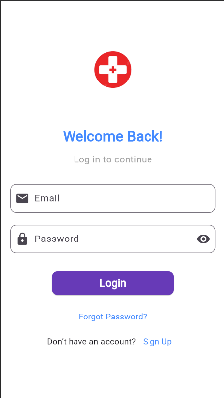

## 🩸 App Screenshots

| Login | Available Donors |
|-------|------------------|
|  |  |

| Nearby Donors | Request for Blood |
|---------------|-------------------|
|  |  |


## ✨ Features

- User Login & Registration
- View available blood donors
- Request for blood with location & type
- Add new donor profiles
- View blood bank dashboard
- Firebase integration for auth & backend

---

## 🚀 Getting Started

### Prerequisites

- [Flutter SDK](https://docs.flutter.dev/get-started/install)
- Android Studio or VS Code
- Firebase Project (Optional but recommended)

### Setup

```bash
git clone https://github.com/cloudmonks-195/Blood-bank-management-system-using-flutter.git
cd Blood-bank-management-system-using-flutter
flutter pub get
